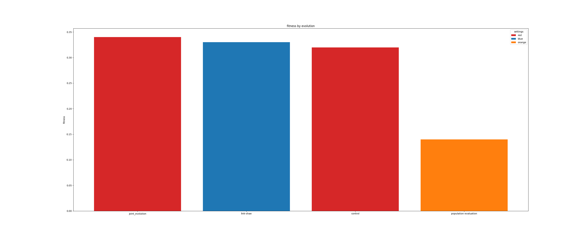

# Introduction

a climbing robot through different population given different genetic algorithm parameters with help of fitness function discussed below.

# setup

integrating the given sandbox arena, and gaussian mountain in the middle, and genome spec, with different experiments done bellow to evolve a robot with climbing ability to the of the mountain.

# update fitness

fitness function is defined as function of the displacement to the top of the mountain, the higher the distance the lower the fitness, and the opposite, in a reciprocal relation, scaled by min-max scalar in the range [0-1], 1 being highest fitness, and 0 being the lowest fitness.

the following is fitness function:

fitness function = $1 - \frac{displacement}{displacement_{max}}$


``` python
def get_distance_to_target(self, target, dist_max=20):
    if target is None or self.last_position is None:
        return 0
    p1 = np.asarray(target)
    p2 = np.asarray(self.last_position)
    diff = p1 - p2
    dist = np.linalg.norm(diff)
    rel_dis = dist/dist_max if dist <= dist_max else dist/200
    assert(rel_dis>=0)
    return 1 - rel_dis

```

# experiments with different genetic algorithms, and genome settings.

in the following tables a series of experiments

| id | iteration | fitness-max | fitness-mean | population | gene count | name          | population iteration  |
|----|-----------|-------------|--------------|------------|------------|---------------|-----------------------|
| 1  | 100       | 0.45        | 0.19         | 10         | 3          | initial       | 2400                  |
| 2  | 100       | 0.54        | 0.32         | 10         | 6          | gene count 6  | 2400                  |
| 3  | 100       | 0.62        | 0.33         | 20         | 6          | population 20 | 2400                  |
| 4  | 100       | 0.58        | 0.14         | 20         | 6          | eval pop 3000 | 3000                  |
|    |           |             |              |            |            |               |                       |

## observation

1- slow,  low fitness, inability to climb, robot links are joints are constrained.
2- higher number of links due to higher gene counts, the robot is bigger, the mobility is higher, and fitness is moderate, increased from 0.45 to 0.54 at iteration 100.
3- population is set to 20, the evolution elected smaller robot, but with higher mobility, and higher fitness, although the robot keeping goes back, and forth, instead of going straight forward, or jumping up, or climbing the mountain.
4- change population evaluation iteration from 2400 to 3000, resulted in lower fitness, and


## experiments with different control settings

| id | iteration | fitness-max | fitness-mean | population | gene count | name          | population iteration | control-wave-form  | control-amp | control-freq |
|----|-----------|-------------|--------------|------------|------------|---------------|----------------------|--------------------|-------------|--------------|
| 1  | 100       | 0.62        | 0.33         | 20         | 6          | adv inital    | 2400                 | 1                  | 0.25        | 1            |
| 2  | 100       | 0.58        | 0.32         | 20         | 6          | adv amp 0.1   | 2400                 | 1                  | 0.1         | 1            |

### observation

reducing control-amp to 0.1 didn't result in higher fitness, on the contrary it reduced the fitness

## link settings

changing link shapes, link length, link radius, and link mass as well as control amplitude.
from experiments link length increases the agility of the robot, as long as the join momentum increase in proportions, although mass contribute to the momentum, but link mass doesn't contribute to robot climbing ability, for simple reason that the simulation sets velocity directly rather than force. experimenting with the control amplitude didn't result in better results compared with multiplying velocity with multiplier, check section below on motor control as function of height.

| id | iteration | fitness-max | fitness-mean | population | gene count | name          | population iteration | link-length  | link-radius | link-mass | control-amp |
|----|-----------|-------------|--------------|------------|------------|---------------|----------------------|--------------|-------------|-----------|-------------|
| 1  | 100       | 0.62        | 0.33         | 20         | 6          | adv inital    | 2400                 | 2            | 1           | 1         | 0.25        |
| 2  | 100       | 0.68        | 0.33         | 20         | 6          | adv inital    | 2400                 | 2            | 1           | 1         | 0.25        |
| 3  | 100       | 0.67        | 0.33         | 20         | 6          | length 5      | 2400                 | 4            | 0.5         | 2         | 0.5         |

### observation

- increasing link length resulted in higher fitness, but the robot link wider, next experiment is increase link length even more, and reduce link radius. (i think deleted)
- link reduction to 4, radius to 0.5, and increase of control amp seams to result in better mobility, but almost the same fitness.


## evolving part of the genome

experiments keeping part of the genome constant didn't result in better evolution, it's done in two ways

### choose part of dna at random

pick 50 percent of the dna at random, and pass the other 50 percent from the crossover, and mutation passed from the genetic algorithm to the new generation during dna update step.

``` python
    def update_dna(self, dna, change_len=-1):
        self.dna[:change_len] = dna[:change_len]
        self.flat_links = None
        self.exp_links = None
        self.motors = None
        self.start_position = None
        self.last_position = None

```

### keep part of dna fixed

other experiment is done by keeping 50 percent of the dna fixed from the parent, and setting the other 50 percent of the dna according to the genetic algorithm mutation, crossover genetic algorithm resulted gns.

``` python
def update_dna(self, dna, parent=None, change_len=-1):
        if parent is not None:
            # 50% of dna from parent
            self.dna[change_len:] = parent[change_len:]
        # other 50% from the mutation
        self.dna[:change_len] = dna[:change_len]
        self.flat_links = None
        self.exp_links = None
        self.motors = None
        self.start_position = None
        self.last_position = None

```

### experiments

| id | iteration | fitness-max | fitness-mean | population | gene count | constant dna | passed dna | mutation |
|----|-----------|-------------|--------------|------------|------------|--------------|
| 1  | 100       | 0.62        | 0.33         | 20         | 6          | 0%            | 0%         | 100%     |
| 2  | 100       | 0.5         | 0.31         | 20         | 6          | 50%           | 0%         | 50%      |
| 3  | 100       | 0.52        | 0.32         | 20         | 6          |  0%           | 50%        |  50%     |

### observation

- changed evolving 100% of the dna through crossover, point_mutate, and shrink_mute, and grow_mutate, versus evolving 50% of the dna, and choosing 50% at random, the fitness mean reduced from 0.33 to 0.31, and fitness-max reduced from 0.62 to 0.52.
- keeping part of the dna fixed (50%), and passing the other part from parent (50%) resulted is slightly better fitness than previous experiment

## motors control function in height

the robot needs to slow down as it climb the mountain toward, such that the higher the fitness the slower the robot.
assume position in z-axis in the range between 0-5 as long as the robot in on the sandbox, we give the robot highest momentum as long as the robot is touching the sandbox, at range 0-1 hight, and reduce momentum linearly with height. by multiplying velocity by const / height.

``` python
for jid in range(p.getNumJoints(rob1)):
            mode = p.VELOCITY_CONTROL
            # assume position in z-axis in the range between 1-5 as long as the robot in on the sandbox
            # variable momentum as function of robot height
            z_height = new_pos[2]
            print('z_height: {}', z_height)
            vel = motors[jid].get_output() * 50/z_height
            p.setJointMotorControl2(rob1,
                        jid,
                        controlMode=mode,
                        targetVelocity=vel)
```

## joints

in this series of experiments i tested different joints: revolute, floating, spherical, hinged, for the climbing ability, both revolute, and spherical gave the highest results. my intuition is that revolute joints serve as ending links, and spherical joints are similar legs.

| id | iteration | fitness-max | fitness-mean | link-length | link-radius | joint type | name         |
|----|-----------|-------------|--------------|-------------|-------------|------------|--------------|
| 1  | 100       | 0.62        | 0.33         | 4           | 0.5         | revolute   | revolute     |
| 2  | 100       | 0.76        | 0.34         | 4           | 0.5         | spherical  | rev-spherical|

set joint types as follows:

``` python
if self.joint_type >= 0.5:
            joint_tag.setAttribute("type", "revolute")
        else:
            joint_tag.setAttribute("type", "spherical")
```

### observation

testing spherical joints side by side by revolute joints resulted in slightly better fitness-mean, and fitness-max, and better agility, still the ability to climb is not high enough.


momentum = mass * velocity, we control the velocity as function of height, velocity = velocity * 7/height

# conclusion

- highest mean fitness results evolved from combing revolute, and spherical joints, changing link shapes.
- keeping part of the dna fixed didn't result in better fitness, picking large portion of the dna during mutation didn't result in better fitness either.
- changing link shapes, link length, link radius, and link mass as well as control amplitude.
from experiments link length increases the agility of the robot, as long as the join momentum increase in proportions, although mass contribute to the momentum, but link mass doesn't contribute to robot climbing ability, for simple reason that the simulation sets velocity directly rather than force. experimenting with the control amplitude didn't result in better results compared with multiplying velocity with multiplier, check section below on motor control as function of height.





# climbing attempts


